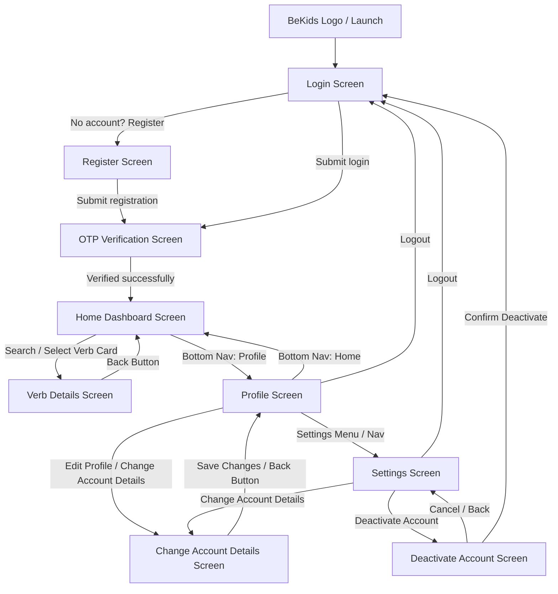

# BeKids English Learning App — Stitch Design System Specification

> **Source Project:** Stitch Project `projects/4794007981983423945`  
> **Design Theme:** Grammar Flow  
> **Brand Identity:** Warm Orange (#FF8C00) & Corporate Modern / EdTech Minimalist  
> **Device Archetype:** Mobile First (with responsive max-width 1024px desktop layout)

---

## 1. Project Overview & All 11 Screens

The **BeKids English Learning App** Stitch project consists of **11 screen instances / design assets**:

| # | Screen / Asset Name | Stitch Screen ID | Dimensions | Role / Description |
|---|---|---|---|---|
| 1 | **BeKids Logo** | `11b86b846e0247209ea5e79f698fddfc` | 1024 × 1024 | Master Brand Logo & Circular Emblem Asset |
| 2 | **Login** | `dcc914b877cb4b959df325e53584d20a` | 780 × 1768 (390w) | Authentication entry with Username & Password fields, password reveal toggle, and register link |
| 3 | **Register** | `53572af7589d4d77ba88719cd7e126e0` | 780 × 1768 (390w) | User registration with Username, Email, Password, Terms & Conditions checkbox, and submit button |
| 4 | **OTP Verification** | `4842296866954e9e840fc0aba0259e87` | 780 × 1768 (390w) | 6-digit PIN verification screen with auto-focus shifting, countdown timer (00:59), and resend action |
| 5 | **Home (Dashboard / Verb Catalog)** | `1e4bdb7827964d529e72fef2eb38b58d` | 780 × 2334 (390w) | Main exploration dashboard: Sticky TopAppBar, Search bar, Core Vocabulary badge, and Bento verb cards with all 5 conjugations |
| 6 | **Verb Details (e.g. "GO")** | `3fbbe99066f542869149d3e0ab04e9e4` | 780 × 4580 (390w) | In-depth verb guide: Top 5 Verb Forms tiles, Hindi Meaning card (`जाना`), Pronunciation (`/ɡoʊ/`), English Meaning, Example Sentences, and Verb Forms Usage table |
| 7 | **Profile** | `ac01b93eb6a0488d91c56e5bfcdffd71` | 780 × 1768 (390w) | User profile screen with avatar, edit badge, "Alex Johnson", email, Edit Profile CTA, Account & Settings links (Change Details, Logout), and bottom navigation |
| 8 | **Settings** | `e64b42eea72e4ba68c5edcd6726ab233` | 780 × 1768 (390w) | Comprehensive settings menu: Account section (Change Account Details), App section (About BeKids, Privacy Policy, Terms & Conditions), and Logout CTA |
| 9 | **Change Account Details** | `dcddc3aea5b3484d95ac911c7fc0560a` | 780 × 1996 (390w) | Transactional edit profile form with avatar upload trigger, Username, Email, New Password inputs, Save Changes / Cancel buttons, and animated success toast |
| 10 | **Deactivate Account** | `4a57ee823bb849fb8fd6431352f0ddc2` | 780 × 1768 (390w) | High-consequence confirmation modal/screen with warning icon, consequences bullet points, Destructive Deactivate button, and Cancel button |
| 11 | **Grammar Flow Design System** | `assets/702d4c0423ea45b6911096541f7a0923` | 960 × 540 | Master Design System canvas with color tokens, typography scales, radius, elevation rules, and component specs |

---

## 2. Screen-to-Screen Navigation & Flow



### Flow Characterization:
1. **Authentication Flow (Linear, Transactional):**
   - Navigation bars (TopAppBar actions & BottomNavBar) are suppressed.
   - User transitions from Login ⇄ Register ➔ OTP ➔ Home.
2. **Main Application Shell (Tabbed):**
   - Persistent `BottomNavBar` on mobile devices with two core tabs: **Home** and **Profile**.
   - Sticky `TopAppBar` with BeKids emblem badge, brand title, and notification bell icon.
3. **Detail & Transactional Sub-flows:**
   - **Verb Details:** Features top app bar with `< arrow_back` returning to Home, plus audio pronunciation CTA in the header.
   - **Change Account Details & Deactivate Account:** Feature back buttons returning to parent Profile/Settings.

---

## 3. Layout Structure of Every Screen

### 3.1 Login Screen (`dcc914b877cb4b959df325e53584d20a`)
- **Container:** Centered card canvas (`max-w-[440px]`), padding `p-container-margin` (20px).
- **Header:** 96×96px (`w-24 h-24`) rounded-xl logo container with subtle border & shadow; `Welcome Back` (`headline-lg-mobile` / `headline-lg`) and supporting caption.
- **Form Card:** White container (`bg-surface-container-lowest`), Level 1 shadow (`0 4px 12px rgba(0,0,0,0.1)`), 16px padding.
- **Inputs:** Username input with left `person` icon, Password input with left `lock` icon and right `visibility` toggle button.
- **Actions:** Full-width Warm Orange button `Login [arrow_forward]`.
- **Footer:** Subtitle with link: "Don't have an account? **Register**".

### 3.2 Register Screen (`53572af7589d4d77ba88719cd7e126e0`)
- **Container:** Centered container (`max-w-[480px]`).
- **Header:** 80×80px (`w-20 h-20`) rounded-2xl logo, `Create Your Account`, supporting caption.
- **Form Card:** `rounded-2xl`, Level 1 ambient shadow, containing Username, Email Address, Password fields with leading icon decorators.
- **Consent:** Terms & Conditions checkbox row with primary-container accented checkbox.
- **Actions:** Full-width rounded-full button `Register [arrow_forward]`.
- **Footer:** Link: "Already have an account? **Login**".

### 3.3 OTP Verification Screen (`4842296866954e9e840fc0aba0259e87`)
- **Container:** Centered container (`max-w-md`), padding `px-container-margin py-xl`.
- **Header:** Logo icon, Title `Verify Your Account` in primary color, Subtitle "Enter the verification code sent to your email."
- **OTP Input Grid:** 6 distinct input boxes (`w-12 h-14` / 48×56px), rounded-lg, centered text, numbers only, auto-focus chain on typing, backspace auto-reversal.
- **Primary CTA:** Full-width rounded-lg button `Verify OTP [arrow_forward]`.
- **Timer / Resend Section:** "Didn't receive the code? Resend OTP in 00:59" with auto-ticking JavaScript countdown.

### 3.4 Home Screen (`1e4bdb7827964d529e72fef2eb38b58d`)
- **Header:** Sticky full-width TopAppBar with circular 'B' badge, 'BeKids' title, and notifications icon button.
- **Greeting Section:** `Hello, Learner!`, subtitle "Learn English verbs and improve your grammar."
- **Search Bar:** Prominent input field with search icon (`bg-[#F9FAFB]`, rounded-xl, 12px padding).
- **Section Heading:** `English Verbs` with pill badge `Core Vocabulary` (`bg-primary-container/10 text-primary px-3 py-1 rounded-full`).
- **Bento Grid:** Multi-column responsive grid (`grid-cols-1 md:grid-cols-2 lg:grid-cols-3 gap-md`):
  - Each Verb Card displays: Verb Title (e.g. "Go", "Be", "Have"), type badge (e.g. "IRREGULAR"), circular play audio button (`bg-primary-container/10 text-primary`), and a 2-column grid showing all 5 verb forms:
    - **1st (Base):** `go`
    - **2nd (Past):** `went`
    - **3rd (Participle):** `gone`
    - **-ing (Gerund):** `going`
    - **s/es (3rd Person):** `goes` (spanning full width with top border)
- **Bottom Navigation Bar:** Mobile docked glassmorphism bar (Home active, Profile inactive).

### 3.5 Verb Details Screen (`3fbbe99066f542869149d3e0ab04e9e4`)
- **Header:** Sticky `h-[72px]` TopAppBar with `arrow_back` button, large verb title (e.g. `GO`), and right-aligned `volume_up` audio button.
- **Main Bento Grid Layout (12-column on desktop / 1-column on mobile):**
  1. **Verb Forms Hero (12 cols):** Title & subtitle, followed by a 5-card horizontal/grid row for `V1 (Base)`, `V2 (Past)`, `V3 (Past Participle)`, `V4 (Present Participle)`, `V5 (Third-Person)`. Active/base form highlighted in Warm Orange.
  2. **Quick Info Column (4 cols):**
     - **Hindi Meaning Card:** Warm orange tinted card (`bg-primary/10 border-primary/20`) with large Hindi script `जाना` and transliteration `(jaana)`, plus watermark icon `translate`.
     - **Pronunciation Card:** Card showing word, phonetic transcription `— /ɡoʊ/`, and circular play button.
     - **Meaning / Explanation Card:** Card with `lightbulb` icon and clear conceptual description.
  3. **Detailed Content Column (8 cols):**
     - **Example Sentences Card:** Card with `format_quote` icon and list of sentences styled with left color borders (`border-l-4 border-primary-container` / `border-tertiary-container`), highlighting the conjugated verb form in bold orange text.
     - **Verb Forms Usage Table:** Structured table with columns: `Form`, `Name`, `Usage Context` with hover transitions.

### 3.6 Profile Screen (`ac01b93eb6a0488d91c56e5bfcdffd71`)
- **Header:** Sticky TopAppBar with BeKids logo & notification button.
- **Profile Header:** 128×128px circular avatar with white border & shadow, overlaid with a floating edit button (`edit` icon, `bg-primary-container`); user name "Alex Johnson", email, and "Edit Profile" button.
- **Account & Settings Bento Card:** Rounded-xl white card with chevron navigation rows:
  - `Change Account Details` (with `manage_accounts` icon)
  - `Logout` (with `logout` icon)
- **Bottom Navigation Bar:** Profile tab active (filled icon & orange text).

### 3.7 Settings Screen (`e64b42eea72e4ba68c5edcd6726ab233`)
- **Header:** TopAppBar with BeKids emblem.
- **Title:** `Settings` (`headline-lg`).
- **Account Group:** Bento card containing `Change Account Details` with `manage_accounts` icon and `chevron_right`.
- **App Group:** Bento card containing `About BeKids` (`info` icon), `Privacy Policy` (`policy` icon), `Terms & Conditions` (`description` icon).
- **Actions Group:** Full-width white card button with `logout` icon and primary orange text.

### 3.8 Change Account Details Screen (`dcddc3aea5b3484d95ac911c7fc0560a`)
- **Header:** TopAppBar with back arrow button (`arrow_back_ios_new`), centered `BeKids` title.
- **Title & Subtitle:** "Account Details", "Update your personal information to keep your profile current."
- **Animated Success Toast:** Green/Orange accented card that animates down when saving.
- **Bento Form Card:**
  - Avatar thumbnail with "Change Photo" action button.
  - Username input (prefilled "AlexStudent").
  - Email Address input (prefilled "alex@example.com").
  - New Password input with helper text "Must be at least 8 characters long."
  - Action buttons: "Save Changes" (primary rounded-full) and "Cancel" (ghost text rounded-full).

### 3.9 Deactivate Account Screen (`4a57ee823bb849fb8fd6431352f0ddc2`)
- **Header:** TopAppBar with back arrow (`arrow_back`) and brand title.
- **Warning Card:** Centered white card with:
  - Error badge: 64×64px red-tinted circle (`bg-error-container text-error`) with `warning` icon.
  - Title: "Deactivate Your Account?"
  - Body explaining temporary account suspension.
  - "Important Information" callout box (`bg-surface-variant`) with bulleted conditions.
  - Danger action button: "Deactivate Account" (`bg-error text-on-error rounded-full`).
  - Secondary action: "Cancel" button.

---

## 4. Colors & Exact Brand Palette

The **Grammar Flow** color system utilizes an intentional EdTech color palette anchored by **Warm Orange** with strict semantic role tokens:

```
┌────────────────────────────────────────────────────────────────────────┐
│                        BEKIDS COLOR PALETTE                            │
├────────────────────────┬─────────────┬─────────────────────────────────┤
│ Role                   │ Hex Code    │ Usage / Notes                   │
├────────────────────────┼─────────────┼─────────────────────────────────┤
│ Primary Accent         │ #FF8C00     │ Warm Orange: buttons, active    │
│                        │             │ tabs, focus rings, highlights   │
│ Primary Deep           │ #904D00     │ High-contrast headers, dark text│
│ Primary Fixed Dim      │ #FFB77D     │ Soft orange accents / glows     │
│ Primary Fixed Light    │ #FFDCC3     │ Subtle pill backgrounds         │
│ On-Primary             │ #FFFFFF     │ Pure white text on orange       │
│ On-Primary Container   │ #623200     │ Deep amber text on orange       │
├────────────────────────┼─────────────┼─────────────────────────────────┤
│ Secondary (Charcoal)   │ #2D3436     │ Headings, bold contrast copy    │
│ Secondary Muted        │ #586062     │ Body copy, secondary subtitles  │
│ Secondary Container    │ #DAE1E3     │ Low-contrast pill badges        │
├────────────────────────┼─────────────┼─────────────────────────────────┤
│ Tertiary (Steel Gray)  │ #556064     │ Form field labels, icons, cues  │
│ Tertiary Light         │ #636E72     │ Instructional text              │
│ Tertiary Container     │ #A1ACB0     │ Inactive badges & borders       │
├────────────────────────┼─────────────┼─────────────────────────────────┤
│ Background             │ #F8F9FA     │ App base background canvas      │
│ Neutral Light / Input  │ #F9FAFB     │ Input background, subtle wells  │
│ Surface (Floor)        │ #FFFFFF     │ Card and modal background       │
│ Surface Container Low  │ #F3F4F5     │ Inset containers, form fields   │
│ Surface Container      │ #EDEEEF     │ Divider lines, subtle borders   │
│ Surface Container High │ #E7E8E9     │ Active hover containers         │
│ Surface Variant        │ #E1E3E4     │ Card outlines, divider borders  │
├────────────────────────┼─────────────┼─────────────────────────────────┤
│ Error / Destructive    │ #BA1A1A     │ Destructive actions, warnings   │
│ Error Container        │ #FFDAD6     │ Danger pill / warning circle bg │
│ On-Error               │ #FFFFFF     │ Text on destructive button      │
│ On-Error Container     │ #93000A     │ Icon on warning badge           │
└────────────────────────┴─────────────┴─────────────────────────────────┘
```

---

## 5. Typography

The design system employs a **dual-font strategy**:
- **Headlines & Display:** `Montserrat` (weights: 600 SemiBold, 700 Bold) for confident, geometric EdTech authority.
- **Body, Labels & Inputs:** `Inter` (weights: 400 Regular, 500 Medium, 600 SemiBold) for crisp, legible educational copy.

### Exact Type Scale Tokens:

| Token Name | Font Family | Size | Weight | Line Height | Letter Spacing | Target Usage |
|---|---|---|---|---|---|---|
| `headline-lg` | Montserrat | 32px | 700 Bold | 40px | -0.02em | Desktop page titles, Hero greetings |
| `headline-lg-mobile` | Montserrat | 24px | 700 Bold | 32px | -0.01em | Mobile TopAppBar titles, Screen H1s |
| `headline-md` | Montserrat | 20px | 600 SemiBold | 28px | Normal | Card titles, Verb headers, Section titles |
| `body-lg` | Inter | 18px | 400 Regular | 28px | Normal | Example sentences, major descriptions |
| `body-md` | Inter | 16px | 400 Regular | 24px | Normal | Standard body copy, inputs, table cells |
| `label-md` | Inter | 14px | 600 SemiBold | 20px | +0.01em | Form labels, button text, table headers |
| `label-sm` | Inter | 12px | 500 Medium | 16px | Normal | Verb form labels (V1..V5), navigation tags |

---

## 6. Buttons & Interactive Controls

1. **Primary Action Button (Warm Orange):**
   - **Background:** `#FF8C00` (Warm Orange)
   - **Text:** `#FFFFFF`, `font-label-md font-bold`
   - **Corner Radius:** `rounded-[16px]` or `rounded-full` (depending on screen context)
   - **Padding:** `py-md px-lg` (16px top/bottom, 24px left/right)
   - **Shadow:** `shadow-md` / `shadow-[0_4px_12px_rgba(0,0,0,0.1)]`
   - **Hover / Active:** `hover:bg-primary` or `hover:opacity-90`, `active:scale-[0.98]`
   - **Icon:** Trailing `arrow_forward` (18-20px)

2. **Circular Play / Audio Button:**
   - **Dimensions:** 32×32px (`w-8 h-8`) on cards; 48×48px (`w-12 h-12`) on detail pages
   - **Background:** `bg-primary-container/10` or solid `bg-primary-container`
   - **Icon:** `play_arrow` or `volume_up` with `FILL 1`
   - **Hover:** Scales up to `1.1x` with color shift

3. **Destructive Button:**
   - **Background:** `bg-error` (`#BA1A1A`)
   - **Text:** `text-on-error` (`#FFFFFF`), `font-bold`
   - **Radius:** `rounded-full`

4. **Ghost / Cancel Button:**
   - **Background:** Transparent / `hover:bg-surface-container-low`
   - **Text:** `text-tertiary` (`#556064`), `font-label-md`
   - **Radius:** `rounded-full`

---

## 7. Input Fields & Form Controls

1. **Standard Form Inputs (Username, Email, Password):**
   - **Background:** `#F9FAFB` (Neutral Grey) / `bg-surface-container-low`
   - **Border:** 1px solid `#E1E3E4` / `#F9FAFB`
   - **Corner Radius:** `rounded-[16px]` or `rounded-2xl` (16px)
   - **Height / Padding:** `py-md` (16px), `pl-[48px]` (accommodates 24px icon decorator), `pr-md` (16px)
   - **Leading Icon:** `person`, `mail`, `lock` positioned at `left-md`, colored in `#556064` (transitions to `#FF8C00` on focus)
   - **Trailing Action:** Password toggle button with `visibility` / `visibility_off` icon
   - **Focus State:** 2px border `#FF8C00` (Warm Orange) with zero ring distortion

2. **Search Input Bar (Home Dashboard):**
   - **Background:** `#F9FAFB` with `border border-secondary/20`
   - **Radius:** `rounded-xl` (12px)
   - **Padding:** `pl-12 pr-4 py-3`
   - **Decorator:** `search` icon at `left-md`

3. **OTP 6-Digit PIN Fields:**
   - **Dimensions:** 48×56px each (`w-12 h-14`)
   - **Typography:** `font-headline-md` centered
   - **Styling:** Spin buttons removed, single character limit, smooth transform on focus (`translateY(-2px)`)

---

## 8. Cards & Containers (Bento Grid Philosophy)

- **Base Card:** Pure white `#FFFFFF` (`bg-surface-container-lowest`), 1px border `border-surface-variant` (`#E1E3E4`), rounded `rounded-xl` (12px - 16px).
- **Verb Card (Home):**
  - Subtle top-right decorative corner arc (`w-24 h-24 bg-primary-container/5 rounded-bl-[100px]`).
  - Inset conjugation table (`bg-surface-variant/30 rounded-lg p-sm`).
  - Hover effect: `translateY(-2px)` with orange glow shadow `0 8px 24px rgba(255, 140, 0, 0.12)`.
- **Hindi Meaning Card (Details):**
  - Highlighted surface `bg-primary/10` with subtle border `border-primary/20`.
  - Watermark background translation icon (`font-size: 120px`, opacity 0.1).
- **Sentence Card:**
  - Inset list items with a 4px solid left border accent (`border-l-4 border-primary-container`).

---

## 9. Border Radius Tokens

| Radius Scale | Value (Rem / Px) | Applied Elements |
|---|---|---|
| `sm` | `0.25rem` (4px) | Checkboxes, tiny tag indicators |
| `DEFAULT` | `0.5rem` (8px) | Inner form tiles, table rows, badges |
| `md` / `xl` | `0.75rem` (12px) | Standard bento cards, search bar |
| `2xl` / `16px` | `1rem` (16px) | Master cards, input fields, modal boxes |
| `full` | `9999px` | Buttons, avatars, pill badges, active tab markers |

---

## 10. Shadows & Elevation

1. **Level 0 (Floor Canvas):** Flat background `#F8F9FA`.
2. **Level 1 (Cards & Inputs):** Ambient soft shadow `box-shadow: 0 4px 12px rgba(0, 0, 0, 0.05 - 0.10)`.
3. **Level 2 (Active / Hover States):** `box-shadow: 0 8px 24px rgba(0, 0, 0, 0.12)` or orange tinted glow `0 8px 24px rgba(255, 140, 0, 0.12)`.
4. **Bottom Nav Shadow:** `box-shadow: 0 -4px 12px rgba(0, 0, 0, 0.10)` providing clear elevation separation above scrolling content.

---

## 11. Iconography (Google Material Symbols Outlined)

All icons use **Google Material Symbols Outlined** font family:
- **Default State:** `font-variation-settings: 'FILL' 0, 'wght' 400, 'GRAD' 0, 'opsz' 24`
- **Active / Filled State:** `font-variation-settings: 'FILL' 1, 'wght' 400, 'GRAD' 0, 'opsz' 24`
- **Key System Icons Identified:**
  - `home` (Navigation)
  - `person` / `manage_accounts` (Profile & Auth)
  - `notifications` (TopAppBar alert)
  - `arrow_back` / `arrow_back_ios_new` (Back navigation)
  - `play_arrow` / `volume_up` (Pronunciation & Audio)
  - `search` (Verb search)
  - `lock` / `mail` / `visibility` / `visibility_off` (Auth fields)
  - `lightbulb` / `format_quote` / `menu_book` / `translate` (Verb details cards)
  - `info` / `policy` / `description` (Settings legal & info)
  - `logout` (Sign out)
  - `warning` (Account deactivation modal)
  - `check_circle` (Success toast)

---

## 12. Bottom Navigation Bar

- **Position:** Docked fixed at the bottom (`fixed bottom-0 left-0 w-full h-16 z-50`).
- **Surface:** Glassmorphic translucent panel `bg-surface/80` with `backdrop-blur-md` (12px blur) and top elevation shadow `shadow-[0_-4px_12px_rgba(0,0,0,0.1)]`.
- **Tabs (Mobile):**
  1. **Home Tab:**
     - Icon: `home` (24px)
     - Label: `Home` (`font-label-sm`)
     - Active State: `text-primary` (`#FF8C00`), `font-bold`, icon filled (`FILL 1`), slight scale `scale-110`.
  2. **Profile Tab:**
     - Icon: `person` (24px)
     - Label: `Profile` (`font-label-sm`)
     - Inactive State: `text-tertiary` (`#556064`), icon outline (`FILL 0`).
- **Responsive Behavior:** Hidden on desktop viewports (`md:hidden`), where navigation moves into a side-nav / header structure.

---

## 13. Headers & Top App Bars

- **Standard Main Header (Home / Profile / Settings):**
  - Fixed/Sticky top bar (`h-[64px]` - `h-[72px]`), background `bg-surface`.
  - Left side: Circular brand badge with letter 'B' (`w-10 h-10 rounded-full bg-primary-container text-white`) alongside bold "BeKids" typography.
  - Right side: Notification bell button (`notifications`).
- **Detail / Transactional Header (Verb Details / Change Details / Deactivate):**
  - Left side: Circular or plain back button (`arrow_back` / `arrow_back_ios_new`) with `bg-surface-container-low`.
  - Center: Screen title or verb name (e.g. `GO` / `BeKids`).
  - Right side: Dedicated contextual action (e.g. `volume_up` pronunciation button).

---

## 14. Verb Table / List Design (Home Dashboard)

Each verb item on the Home dashboard is presented as an interactive Bento card:
- **Card Header:** Large verb name (e.g., **Go**, **Be**, **Have**) with category badge (**IRREGULAR**) and circular audio play button.
- **Card Conjugation Grid:** 2-column inset box containing all 5 principal parts:
  - `1st (Base)`: e.g. `go`
  - `2nd (Past)`: e.g. `went`
  - `3rd (Participle)`: e.g. `gone`
  - `-ing (Gerund)`: e.g. `going`
  - `s/es (3rd Person)`: e.g. `goes` (full-width divider row)

---

## 15. Verb Details Page Design (Deep Dive)

The Verb Details view (`3fbbe99066f542869149d3e0ab04e9e4`) contains a comprehensive 6-component layout:
1. **Verb Forms 5-Tile Hero:** Displays `V1 (Base)`, `V2 (Past)`, `V3 (Past Participle)`, `V4 (Present Participle)`, and `V5 (Third-Person)`.
2. **Hindi Meaning Card:** Prominent orange container featuring Devanagari script `जाना` and romanized transliteration `(jaana)`.
3. **Pronunciation Card:** Clean phonetic guide (`Go — /ɡoʊ/`) with animated audio trigger button.
4. **Meaning & Grammar Explanation:** Card with educational definition of the verb semantics.
5. **Example Sentences:** List of contextual sentences with left colored borders and tense badges (`Present Habit (V1)`, `Completed Action (V2)`, `Present Perfect (V3)`, `Continuous Action (V4)`).
6. **Usage Context Table:** A full 5-row table articulating grammatical rules, sentence structures, and tense rules for each form.

---

## 16. Profile & Settings UI

- **Profile View:** Clean presentation with 128px user avatar, floating edit badge, "Alex Johnson", email address, and direct access to settings items.
- **Settings View:** Categorized bento groups:
  - **Account Group:** "Change Account Details"
  - **App Group:** "About BeKids", "Privacy Policy", "Terms & Conditions"
  - **Action Group:** Prominent "Logout" CTA in Warm Orange.
- **Account Details Form:** Allows updating Username, Email Address, and setting a New Password, complete with photo upload trigger and success toast feedback.
- **Deactivate Modal / Screen:** Red danger theme with consequence warning items and explicit confirmation flow.

---

## 17. Responsive & Mobile Behavior

- **Mobile Viewport (Base 390px - 780px canvas):**
  - Fluid single-column layouts with 20px container margins (`px-container-margin`).
  - Fixed bottom navigation bar (`h-16`) with safe area padding (`pb-safe`).
  - Compact typography (`headline-lg-mobile: 24px`).
- **Desktop / Tablet Viewport (768px - 1024px max-width):**
  - Constrained max-width container (`max-w-[1024px] mx-auto`).
  - Bento multi-column grid (`grid-cols-2` and `grid-cols-3` for verb cards; 12-column layout for verb details).
  - Scaled typography (`headline-lg: 32px`).
  - Bottom navigation is hidden; navigation translates to header/sidebar patterns.

---

## 18. Reusable Component Inventory

| Component Name | File / Target Element | Key Classes & Props |
|---|---|---|
| `TopAppBar` | `<header>` | Sticky top-0, brand badge, notifications or back button |
| `BottomNavBar` | `<nav>` | Docked bottom-0, glassmorphism `backdrop-blur-md`, Home/Profile tabs |
| `VerbCard` | `<article>` | Bento card, irregular badge, 5-conjugation sub-grid, play CTA |
| `VerbFormTile` | `<div>` | V1..V5 indicator tile, bold verb text, hover border transition |
| `HindiMeaningCard` | `<div>` | `bg-primary/10`, Hindi script text, background watermark icon |
| `ExampleSentenceItem` | `<li>` | `border-l-4 border-primary-container`, bold highlighted verb form |
| `VerbUsageTable` | `<table>` | 3-column table (Form, Name, Usage Context) with hover rows |
| `PrimaryButton` | `<button>` | `bg-[#FF8C00]`, text-white, `rounded-[16px]` or `rounded-full`, shadow |
| `DestructiveButton` | `<button>` | `bg-error text-on-error rounded-full` |
| `InputField` | `<div> + <input>` | `rounded-[16px]`, leading Material icon, Warm Orange focus ring |
| `OtpInputGroup` | `<div id="otp-container">` | 6 individual numeric inputs with auto-advance and countdown |
| `SuccessToast` | `<div>` | Animated slide-down feedback alert |

---

*This specification serves as the immutable single source of truth based on the Stitch Project `projects/4794007981983423945`.*
